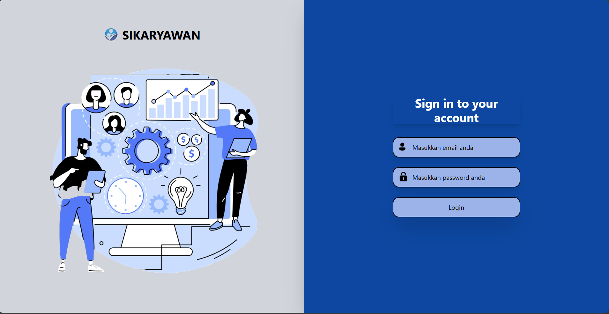
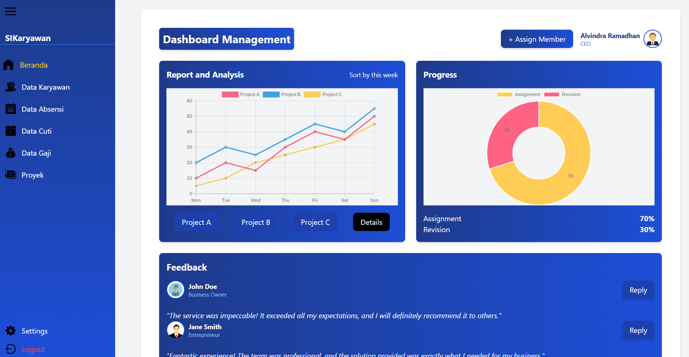
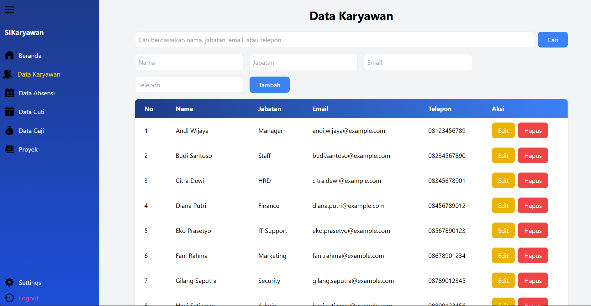

# Manajemen Sistem Karyawan

## Deskripsi Proyek

Manajemen Sistem Karyawan adalah aplikasi berbasis web yang dirancang untuk memudahkan pengelolaan data karyawan dalam sebuah perusahaan. Aplikasi ini memiliki fitur CRUD (Create, Read, Update, Delete) data karyawan, serta fungsi tambahan seperti pencarian, pengelolaan data karyawan, dan laporan sederhana.

## Teknologi yang Digunakan

- **HTML5**: Untuk struktur halaman web.
- **CSS3 (Tailwind CSS)**: Untuk desain responsif dan antarmuka pengguna yang menarik.
- **JavaScript**: Untuk interaktivitas dan pengelolaan data dinamis.
- **React.js**: Untuk membangun antarmuka pengguna yang terorganisasi.
- **JSON**: Untuk penyimpanan data sementara.
- **Git & GitHub**: Untuk manajemen versi dan kolaborasi.

## Fitur Utama

- **CRUD Data Karyawan**: Menambahkan, melihat, mengedit, dan menghapus data karyawan.
- **Pencarian Data**: Filter data karyawan berdasarkan nama, jabatan, atau status kehadiran.
- **Data Karyawan dan Laporan GAJI**: Pengelolaan data karyawan dan laporan sederhana tentang gaji karyawan.
- **Desain Responsif**: Antarmuka yang optimal untuk desktop, tablet, dan perangkat mobile.
- **Navigasi Sederhana**: Navigasi intuitif melalui menu utama.
- **Validasi Formulir**: Validasi input data untuk mengurangi kesalahan.

## Cara Instalasi

1. **Kloning repositori ini**:
   ```bash
   git clone https://github.com/Alvin121005/proyek-tekweb.git
   ```
2. **Masuk ke folder proyek**:
   ```bash
   cd proyek-tekweb
   ```
3. **Instal dependensi**:
   ```bash
   npm install
   ```
4. **Jalankan aplikasi**:
   ```bash
   npm start
   ```
5. Akses aplikasi melalui [http://localhost:3000](http://localhost:3000).

## Cara Penggunaan

1. **Beranda**:
   - Lihat daftar karyawan.
   - Gunakan fitur pencarian untuk menemukan karyawan tertentu.
2. **Tambah Data Karyawan**:
   - Klik tombol "Tambah Karyawan".
   - Isi formulir dengan data karyawan baru dan simpan.
3. **Edit atau Hapus Data**:
   - Klik tombol "Edit" untuk memperbarui informasi karyawan.
   - Klik tombol "Hapus" untuk menghapus data karyawan.
4. **Laporan Data**:
   - Akses laporan jumlah karyawan berdasarkan jabatan melalui halaman "Laporan".

## Screenshot

### Login Aplikasi



### Beranda Aplikasi



### Halaman CRUD

